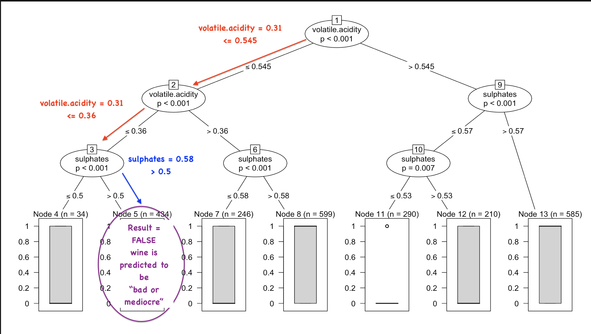

---
output:
  html_document: default
  pdf_document: default
  word_document: default
---

```{r global_options, include=FALSE}
knitr::opts_chunk$set(echo=FALSE, warning=FALSE, message=FALSE)
```
#Wine Appreciation by The Numbers 

####*by Anna Signor*


What is "good" wine? This is a captivating subject, since so much actual economy rides on judgements considered by many to be elusive. 

Join me in exploring data pertaining to the analysis of over 6,000 instances of Portuguese Vinho Verde, juxtaposing objective measurements with the quality ratings of experts. Can we decode what makes an expert give a wine a high quality mark? Are they biased toward reds or whites? Are "better" wines less sweet? Let's find out.

(I reccomend this read to go along one glass of your favorite wine.)

```{r echo=FALSE, message=FALSE, warning=FALSE, packages}
library(dplyr)
library(tidyr)
library(caTools)
library(ggplot2)
library(memisc)
library(lattice)
library(wesanderson)
pal = wes_palette("Cavalcanti1")
```

```{r echo=FALSE, Load_the_Data}
wines <- read.csv('wineQualityAll.csv')
wines$X <- NULL
```

## Sample the data

Let's get to know our data set. You can find the complete information furnished buy the publishers [here](link=https://s3.amazonaws.com/udacity-hosted-downloads/ud651/wineQualityInfo.txt).
In their words:

*...two datasets were created, using red and white wine samples. The inputs include objective tests (e.g. PH values) and the output is based on sensory data (median of at least 3 evaluations made by wine experts). Each expert graded the wine quality between 0 (very bad) and 10 (very excellent).*

I merged the two set and added a column called type to indicate red or white, so we have the columns:
```{r echo=FALSE, Sample}
names(wines)
```

Please note that I merged the two sets together and the field ```type``` indicates red or white. 
You can refer to the [same link as above ](link=https://s3.amazonaws.com/udacity-hosted-downloads/ud651/wineQualityInfo.txt) to get detailed definitions.


Here are the variables with the units of measurement and their vernacular names, quoted from the original published article:

<i>   
   1 - fixed acidity (tartaric acid - g / dm^3)
   
   2 - volatile acidity (acetic acid - g / dm^3)
   
   3 - citric acid (g / dm^3)
   
   4 - residual sugar (g / dm^3)
   
   5 - chlorides (sodium chloride - g / dm^3
   
   6 - free sulfur dioxide (mg / dm^3)
   
   7 - total sulfur dioxide (mg / dm^3)
   
   8 - density (g / cm^3)
   
   9 - pH
   
   10 - sulphates (potassium sulphate - g / dm3)
   
   11 - alcohol (% by volume)
   
   Output variable (based on sensory data): 
   
   12 - quality (score between 0 and 10)
</i>

---

# Univariate Plots Section

The first thing I'd like to know if if I have to account for a bias toward red or white in terms of quality.
Let's look at their summaries.

Whites:
```{r echo=TRUE, Summary1}
whites <- filter(wines, type == 'white')
reds <- filter(wines, type == 'red')
summary(whites$quality)
```

Reds:

```{r echo=TRUE, Summary2}
summary(reds$quality)
```

The distribuition stats are very similar, it looks only like the mean for whites is slightly higher. How do they look side by side?

```{r echo=FALSE, Hostograms1}

plot <- ggplot(wines, aes(x=factor(quality), fill=type))
plot + geom_bar(position='identity', alpha=0.7) + 
  scale_fill_manual(values=rev(pal[4:5])) +
  geom_vline(
      linetype = 'solid',
      lwd = 1,
      data = whites,
      aes(mapping), 
      xintercept = mean(whites$quality), 
      color=pal[4], 
      show.legend = NA) +
  geom_vline(
      linetype = 'longdash', 
      lwd = 1,
      data = whites,
      aes(mapping), 
      xintercept = median(whites$quality), 
      color=pal[4], 
      show.legend = NA) +
  geom_vline(
      lwd = 1,
      linetype = 'solid',
      data = reds,
      aes(mapping), 
      xintercept = mean(reds$quality), 
      color=pal[5], 
      show.legend = NA) +
  geom_vline(
      linetype = 'twodash', 
      lwd = 1,
      data = reds,
      aes(mapping), 
      xintercept = median(reds$quality), 
      color=pal[5], 
      show.legend = TRUE)
```

It is interesting to see the full distribuitions side by side. While the difference between the means looks small, and the medians are the same, the shape of the distribuitions are different, and it looks like white wines score better. I should also point out that the median being the same has reduced meaning when the variable being measured is ordinal.

And here is the combined distribuition:

```{r echo=FALSE, Histograms2}
plot <- ggplot(wines, aes(x=factor(quality)))
plot + geom_bar(alpha=0.7, fill=pal[1]) +
geom_vline(
      lwd = 1,
      linetype = 'solid',
      aes(mapping), 
      xintercept = mean(wines$quality), 
      color=pal[1], 
      show.legend = NA) +
  geom_vline(
      linetype = 'twodash', 
      lwd = 1,
      data = reds,
      aes(mapping), 
      xintercept = median(wines$quality), 
      color=pal[1], 
      show.legend = TRUE)
```

Separately or combined, they are both normal-like disribuitions. In the back of my head, I am putting a pin on this. If I try to write a predictor for the quality, I need to be careful. We already know this distribuition, so any valuable predictor needs to be better than just guessing around the mean or the median, because this could produce deceptively good results without actually adding value to a simple study of the distribuition.

I wonder which measured attributes do not behave that way.

```{r echo=FALSE, Violins1}
d <- reshape2::melt(wines[])
ggplot(d, aes(y = value, x = variable)) + 
    facet_wrap(~variable, scales = "free") + 
   # geom_histogram(fill=quant)
  geom_violin( aes( y = value),
      draw_quantiles = 0.5, 
      scale = "count", 
      trim = TRUE, 
      alpha=0.4,
      fill=pal[1],
      color=pal[1])
```

Some distribuitions are extremely skewed, like chlorides and residual sugar. In fact, so much so that it is hard to get a sense for the distribuition. Let's look at the same plot with a log scale.

```{r echo=FALSE, violins2}
d <- reshape2::melt(wines[])
ggplot(d, aes(y = value, x = variable)) + 
    facet_wrap(~variable, scales = "free") + 
   # geom_histogram(fill=quant)
  geom_violin( aes( y = value),
      draw_quantiles = 0.5, 
      scale = "count", 
      trim = TRUE, 
      alpha=0.4,
      fill=pal[1],
      color=pal[1]) +
  scale_y_log10()
```


This is how it looks for whites:

```{r echo=FALSE, Violins2}
d <- reshape2::melt(whites[])
ggplot(d, aes(y = value, x = variable)) + 
    facet_wrap(~variable, scales = "free") +
  geom_violin( aes( y = value),
      draw_quantiles = 0.5, 
      scale = "count", 
      trim = TRUE, 
      alpha = 0.4,
      fill = pal[4],
      color = pal[4]) 
```


And with the same consideration regarding the extreme distribuitions:

```{r echo=FALSE, Violins3}
d <- reshape2::melt(whites[])
plot <-
  ggplot(d, aes(y = value, x = variable)) + 
      facet_wrap(~variable, scales = "free") +
    geom_violin( aes( y = value),
        draw_quantiles = 0.5, 
        scale = "count", 
        trim = TRUE, 
        alpha = 0.4,
        fill = pal[4],
        color = pal[4]) +
    scale_y_log10()
plot
```

And the same two plots for reds

```{r echo=FALSE, Violins5}
d <- reshape2::melt(reds[])
plot1 <- 
  ggplot(d, aes(y = value, x = variable)) + 
    facet_wrap(~variable, scales = "free") +
    geom_violin( aes( y = value),
      draw_quantiles = 0.5, 
      scale = "count", 
      trim = TRUE, 
      alpha = 0.4,
      fill = pal[5],
      color = pal[5])
plot2 <- plot1 + scale_y_log10()
plot1
plot2
```

I want to see the two log10 grids next to one another and compare:

```{r echo=FALSE, Violins6}
plot
plot2
```

```{r echo=FALSE, maintenance}
plot <- NULL
```

## Univariate Analysis

From this one-dimensional analysis I learned a lot. Firstly, the quality grades are in a normal-like distribution, so will need to be very strict before celebrating the accuracy of any predictive model. 

Another important lesson is to note the skewed distribuitions for some of the variables, like residual sugar. Moving to more than one variable, this analysis may benefit from axes tranformations.

It is very hard to get any answers without exploring the relationships between the different features and their relationships to the quality. We do that next.

------

# Bivariate Plots Section

One feature that stood out to me was the volatile acidity. This is how I understood from their documentation: volatile acidity is the kind that goes away in time after opening a bottle of wine, versus the actual acidity that "belongs" in the wine. I always heard that the best red wines don't need to breathe, you can drink as soon as the bottle is opened. (And I never heard of white wines needing to breathe at all.) I wonder if that is related to the volatile acidity, and if we can see that in the data.

Let's first plot the volatile acidity against the quality.

```{r echo=FALSE, Violins7}
ggplot(reds, aes(x=quality, y=volatile.acidity)) +
  geom_jitter(alpha=0.07, size=3, color=pal[5]) + 
  geom_violin(aes(group = quality),
              scale = 'count',
              fill = pal[5], 
              color = pal[5], 
              alpha=0.001,
              draw_quantiles = 0.5)  
summary(reds$volatile.acidity)
```

```{r echo=FALSE, Jitter1}
ggplot(reds, aes(x=quality, y=volatile.acidity)) + 
  geom_jitter(alpha=0.07, size=3, color=pal[5]) +
  geom_smooth(method = loess, color = pal[5], fill = pal[5])
summary(reds$volatile.acidity)
```

There seems to be a trend where the quality increases with the decrease in volatile acidity. It seems they may be inversely correlated.

What happens if we include the whites? I would expect the relationshit to be different than with the reds, because I never heard of white wine having to breathe. 

```{r echo=FALSE, Vioins8}
ggplot(whites, aes(x=quality, y=volatile.acidity)) +
  geom_jitter(alpha=0.07, size=3, color=pal[4]) + 
  geom_violin(aes(group = quality),
              scale = 'count',
              fill = pal[4], 
              color = pal[4], 
              alpha=0.1,
              draw_quantiles = 0.5)  
summary(whites$volatile.acidity)
```

```{r echo=FALSE, Jitter2}
ggplot(whites, aes(x=quality, y=volatile.acidity)) + 
  geom_jitter(alpha=0.07, size=3, color=pal[4]) + 
  geom_smooth(method = loess, color = pal[4], fill = pal[4])
summary(reds$volatile.acidity)
```
 
In whites,the correlation much weaker, or is less evident. Also, the volatile acidity is significantly and consistently less than in reds. In red wines, the range is 0.12 - 1.58 g/dm<sup>3</sup>, while in whites it is 0.08 - 1.00g/dm<sup>3</sup>. It also seems that low quality wines have higher volatile acidity than their type mates, no matter what. 


A popular conception is that sweet wines are "bad". Let's take stab at that one. 

```{r echo=FALSE, Violins9}
ggplot(wines, aes(x=quality, y=residual.sugar)) + 
  geom_violin(aes(group = quality, fill=type),
              scale = 'count',
              fill = pal[1], 
              color = pal[1], 
              alpha=0.1,
              draw_quantiles = 0.5)  
summary(wines$residual.sugar)
```

It looks like we hae better eliminate the outliers at the top to properly see the scales here.

```{r echo=FALSE, Vioins10}
data <- filter (wines, residual.sugar < 30)
ggplot(data, aes(x=quality, y=residual.sugar)) + 
  geom_violin(aes(group = quality),
              scale = 'count',
              fill = pal[1], 
              color = pal[1], 
              alpha=0.1,
              draw_quantiles = 0.5)  
summary(wines$residual.sugar)
```

It is still hard to see. Let's eliminate the entire upper quartile.

```{r echo=FALSE, Plot_1a}
data <- filter (wines, residual.sugar < summary(wines$residual.sugar)[6])
ggplot(data, aes(x=quality, y=residual.sugar)) + 
  geom_violin(aes(group = quality),
              scale = 'count',
              fill = pal[1], 
              color = pal[1], 
              alpha=0.1,
              draw_quantiles = 0.5)  
summary(wines$residual.sugar)
```

I'd really be surprised if there is any correlation here. At least for Vinho Verde, this myth is bust. All we can say is that white wines in that family are consistently higher in sugar content, which surprised me a lot.

Let's look at the impact of free sulfides into quality:

```{r echo=FALSE, Jitter3}
wines %>% 
  ggplot(aes(x=quality, y=free.sulfur.dioxide)) + 
    geom_jitter(size=3, aes(color=type), alpha = 0.07) +
    geom_smooth(method = loess, aes(color=type)) +
    scale_color_manual(values=rev(pal[4:5])) 
```

The biggest piece of information is the difference between reds and whites. It seems like, at least by itself, the free sulfide content has no meaningful relationship with the quality.

Volatile acidity vs acidity:

```{r echo=FALSE, Jitter4}
ggplot(wines, aes(x=fixed.acidity, y=volatile.acidity)) + 
  geom_point(size=1, alpha=0.2, aes(color=type)) + 
  geom_smooth(aes(color=type, fill=type), alpha = 0.2) +
  geom_smooth(color = pal[1], fill = pal[1], alpha = 0.2, aes()) +
  scale_color_manual(values=rev(pal[4:5])) 
```

I see the possibility of a correlation, but only in reds. Let's look at just them:

```{r echo=FALSE, Jitter5}
ggplot(reds, aes(x = fixed.acidity, y = volatile.acidity) ) + 
  geom_point(size=1, alpha = 0.2, color = pal[5]) + 
  geom_smooth(alpha = 0.2, fill = pal[5], color = pal[5])  
```

There are some signs pointing to a correlation, more visible now. I'd also guess that it is conditioned on other variables, which may be responsible for the outliars. I am just going to take some guesses on what they could be, maybe I'll get lucky. So I am plotting just the red wines data, with a color distortion on my lurking variable candidates. If the outliars tend to appear in a color that stands out, that will likely be a lurking variable to this correlation. In other words, in the plots to come, what we will be looking for is a lot of the same color away or close to the trend line.

Citric Acid:

```{r echo=FALSE, Jitter6}
#function for this plot type
find_lurker <- function(frame, candidate){
  plot <-
    ggplot(frame, aes(x = fixed.acidity, y = volatile.acidity) ) + 
    geom_point(size=1, alpha=0.2, aes(color=candidate)) + 
    scale_color_continuous(low = pal[1], high = pal[2]) +
    geom_smooth(alpha = 0.2, color = pal[1]) +
    scale_fill_continuous(low = pal[1], high = pal[2])
  return(plot)
}
find_lurker(reds, reds$citric.acid)
```

I don't necessarily see a color pattern playing off the trendline, but this variable seems correlated with the fixed acidity. Let's check:

```{r echo=FALSE, Jitter7}
ggplot(reds, aes(x = fixed.acidity, y = citric.acid) ) + 
  geom_point(size=1, alpha = 0.2, color = pal[1]) + 
  geom_smooth(alpha = 0.2, fill = pal[1], color = pal[1])  
```

Nice. They look correlated.

Sugar content:

```{r echo=FALSE, Jitter8}
find_lurker(reds, reds$residual.sugar)
```

Sulphates:

```{r echo=FALSE, Jitter9}
find_lurker(reds, reds$sulphates)
```


Alcohol:

```{r echo=FALSE, Jitter10}
find_lurker(reds, reds$alcohol)
```

This one looks more interesting. You can kind of see a lot of green away from the trendline, but not a jackpot.

```{r echo=FALSE, Jitter11}
ggplot(reds, aes(x = fixed.acidity, y = alcohol) ) + 
  geom_point(size=1, alpha = 0.2, color = pal[1]) + 
  geom_smooth(alpha = 0.2, fill = pal[1], color = pal[1])
```

Mmm.. Log on x?

```{r echo=FALSE, Jitter12}
ggplot(reds, aes(x = fixed.acidity, y = alcohol) ) + 
  geom_point(size=1, alpha = 0.2, color = pal[1]) + 
  geom_smooth(alpha = 0.2, fill = pal[1], color = pal[1]) +
  scale_x_log10()
```

Meh.. nothing to see here.

Chlorides:

```{r echo=FALSE, Jitter13}
find_lurker(reds, reds$chlorides)
```

This one looks more interesting. You can kind of see a lot of green away from the trendline, but not a jackpot. There is green kind of everywhere... Let's try:

```{r echo=FALSE, Jitter14}
ggplot(reds, aes(x = fixed.acidity, y = chlorides) ) + 
  geom_point(size=1, alpha = 0.2, color = pal[1]) + 
  geom_smooth(alpha = 0.2, fill = pal[1], color = pal[1]) 
```

Nothing of interest here.

Density:

```{r echo=FALSE, Jitter15}
find_lurker(reds, reds$density)
```

This one just looks well correlated with the fixed acidity. Let's look at that:

Density

```{r echo=FALSE, Jitter16}
ggplot(reds, aes(x = fixed.acidity, y = density) ) + 
  geom_point(size=1, alpha = 0.2, color = pal[1]) + 
  geom_smooth(alpha = 0.2, fill = pal[1], color = pal[1])  
```

Bingo! 

Moving on, I'd like to see if there is an apparent correlation between alcohol content and quality:

```{r echo=FALSE, Jitter17}
ggplot(reds, aes(x = alcohol, y = quality) ) + 
  geom_jitter(size=1, alpha = 0.2, color = pal[3]) + 
  geom_smooth(alpha = 0.2, fill = pal[3], color = pal[3], method = loess)  
```

Now, this is interesting. This seems to be a very relevant factor.


Let's look at each variable besides the quality and type plotted against quality  as a smooth trendlineThis should give us a good high-level view of the correlations between the variables and their conributions to the quality feature.

```{r echo=FALSE, Grid1}
wines%>%
  gather(-quality, -type, key = "var", value = "value") %>%
  ggplot(aes(x = value, y = quality)) +
    geom_jitter(size=0.01, alpha = 0.1, aes(color = type, fill=type)) +
    geom_smooth(lwd=0.5, alpha = 0.3, aes(color = type, fill=type), method =loess ) +
    facet_wrap(~var, scales = "free") +
    scale_color_manual(values=rev(pal[4:5]))
```

The dots are really just adding clutter here. I really just want to explore the possible nature of relationship, not strengh just yet. Instead, let's look at the same plot as above, without the geom jitter.

```{r echo=FALSE, Grid2}
finalplot1 <- 
wines%>%
  gather(-quality, -type, key = "var", value = "value") %>%
  ggplot(aes(x = value, y = quality)) +
    geom_smooth(lwd=0.5, aes(color = type, fill=type), alpha = 0.3, method =loess ) +
    facet_wrap(~var, scales = "free") +
    scale_color_manual(values=rev(pal[4:5])) 

finalplot1
```

The first thing that stands out to me, looking at this, is how some of the relatioships are very different for reds and whites. In some cases, the relationships are "opposing", as in with sulphates and total sulfur dioxide. In other cases you see a feature be relevant in one type and not in the other, as in free sulfur dioxide. Furthermore, the error bands are much wider for the white wines, indicating I may find stronger relationships in the red wine set. 

For this reason, this exploration will proceed for red wines only. (I understand now why the publishers had this as two separate data sets.)

```{r echo=FALSE, Grid3}
plot_reds <-
reds%>%
  gather(-quality, -type, key = "var", value = "value") %>%
  ggplot(aes(x = value, y = quality)) +
    geom_smooth(lwd=0.5, alpha = 0.3, method =loess, color = pal[5], fill = pal[5]) +
    geom_jitter(size=0.01, alpha = 0.1, color = pal[5]) + 
    facet_wrap(~var, scales = "free") 
plot_reds
```

Now that this is cleaner, on a second look, some pairs of features stand out as having possible similar relationships with the quality, which means that they could be correlated. Of note:

  - fixed acidity and PH, which is hardly surprising
  - alcohol and total sulfur dioxide seem almost like mirror images of each other

As far as the strengh of the relationship with the quality, it seems like the alcohol, volatile acidity and density have the overall strongest relationships, note the reduced width of the error band.  


# Bivariate Analysis

The first guess I took, based on the fact that red wines have to "breathe" in general, but not the best wines, is an inverse relationship between the volatile acidity and the quality. We found the relationship is definitely there, for red wines. In further accordance with expectations, the relationship is different with white wines and the same behavior is not observed.

I tried to explore another piece of popular wisdom, or at leat my oprational definition thereof, that sweet wines are not good quality, by looking for an inverse correlation between residual sugar and quality. I was unable to find any such relationship.

My next exploration was looking at the relationship between volatile and fixed acidity, and looking for possible variables that may be correlated with either one. By doing this, I found another correlated pair: density and acidity.

Concluding the bivariate exploration, I took a general look at all the relationships between each feature and the quality. I found a "separation" between red and white wines in terms of those relatioships. For this reason coupled with my own personal preference, *I will proceed with an exploration for red wines only*. Looking at the grid of scaterplots + regression lines, some pairs of features stand out as possible candidates for intercorrelation. In the next session, I will explore those.

------------

# Multivariate Plots Section

Let's start by looking at the last plot from the last section, showing the relationships between each feature and the quality:

```{r echo=FALSE, Grid4}
plot_reds
```

It looks like a lot of these features are strong and discerning.
Because of this, I will try a decision tree. Decision trees work best when the predicted value is categorical or ordered. So, let's call a wine "ge" for "good or excellent"" when the quality grade is 6 or more, and bm for "bad or mediocre" otherwise. 

```{r echo=FALSE, Output2}
reds$grade <- ifelse(reds$quality > 5, "ge", "mb")
reds$grade_f <- factor(reds$grade)
rev(reds[1:5, ])
```

As you can see, now we have a grade, which can only assume two values, and a factor column corresponding to it.
Now, let's split the data in to train and test, at a 75% rate, and take a peek at the train set just to make sure everything looks normal.

```{r echo=FALSE, Output3}

set.seed(101) 
Y <- reds$grade_f
sample = caTools::sample.split(Y, SplitRatio = 3/4)
train = subset(reds, sample == TRUE)
test  = subset(reds, sample == FALSE)
rev(train[1:5, ])
```

Let's look at a representation of a decision tree using only the features volatile acidity and sulphates content. Here, I made a deliberate decision to use feature that give strong correlations, and to use one positively and one negatively correlated (or apparently so), to give us the best chance to see a decent tree. Using two features is in no way the best modeling strategy, but it yields a good graphical representation of how decision trees work. We will eventually include more features, and that will look impalatable as a graph.

```{r echo=FALSE, fig.width=15, Tree1}
# Create the tree.
  require(party)
  tree <- ctree(
  grade_f ~ 
            + volatile.acidity 
            + sulphates, 
          data = train)
plot(tree) 
```

To understand how the decision tree is working, let's consider an example, from the test set.

```{r echo=TRUE, Output6}
rev(test[8, ] )
```

This particular data point is a wine with a volatile acidity value of 0.31g/dm<sup>3</sup>, suplphates at 0.58g/dm<sup>3</sup>, and a quality rating of 5, which makes it a "mediocre or bad" wine, per our definition of grade. The diagram below shows how the tree above would predict this wine's quality.

```{r pressure, Output22}

```

Picking just two features is a simplistic way to proceed (although I exercised judgement in picking them), but just for curiosity, let's lee what accuracy we got from that, by testing the model with data that was not used to build the tree, that is the test data.

```{r echo=FALSE, fig.width=20, TreePerf1}
p <- predict(tree, newdata=test, type="response")
test_p <- test 
test_p$p <- p
test_p %>%
  ggplot(aes(x=quality, y=grade_f)) +
  geom_jitter(aes(color=p), alpha = 0.4, shape=15, size=2) +
  scale_color_manual(values=pal) 
```

This does not look the greatest. What we are looking for is a segregation of yellow and green Let's check the confusion matrix for this:

```{r echo=FALSE, TreePerf2}
confMat <- table(test$grade_f, predict(tree, newdata=test, type="response"))
sum(diag(confMat))/sum(confMat)
confMat
```

Now, let's build a tree with all the features, which will likely perform better, but will not look good plotted.

```{r echo=FALSE, TreePerf5}
#build the tree with train data
tree <- ctree(
  grade_f ~ fixed.acidity 
            + volatile.acidity 
            + citric.acid 
            + residual.sugar 
            + chlorides
            + free.sulfur.dioxide
            + total.sulfur.dioxide
            + density 
            + pH 
            + sulphates 
            + alcohol
            , data = train)
#create predicted vector and append to test
test_p <- NULL
p <- predict(tree, newdata=test, type="response")
test_p <- test 
test_p$p <- p
#plot test comparing actual vs predicted
test_p %>%
  ggplot(aes(x=quality, y=grade_f)) +
  geom_jitter(aes(color=p, fill=p), size = 2, alpha = 0.4) +
  scale_color_manual(values=rev(pal[1:2])) 
```

Confusion matrix and accuracy:

```{r, echo=FALSE, prediction1}
confMat<-NULL
confMat <- table(test$grade_f, predict(tree, newdata=test, type="response"))
sum(diag(confMat))/sum(confMat)
confMat
```

...and the accuracy is 74% not bad for an out-of-the box tree with littl to none feature engineering.  

Thi is a fine way to see our classifier perform, but let's plot something a tad more interesting. To get a more comprehensive qualitative perception of the classifier's behavior, we can facet wrap the same plot above, with alcohol vs ech of the other features,since quality and grade are information redundant with with the prediction.

```{r, echo=FALSE, fig.width=8, fig.height=6, TreePerf7}
test_p$type <- NULL
test_p$grade <- NULL
test_p$quality <- NULL
test_p %>%
  gather(-grade_f, -p, -alcohol, key = 'var', value = 'value') %>%
  ggplot(aes(x=value, y=alcohol, shape = grade_f)) +
  geom_jitter(aes(color=p, fill=p), size = 2, alpha = 0.4) +
  facet_wrap(~var, scales = "free", ncol=4) +
  scale_color_manual(values=rev(pal[1:2])) +
  scale_shape_discrete()

```

Above, the points are colored yellow when they are predicted to be bad or mediocre, and green if they are predicted to be good or excellent. In addition, they are triangles if they are actually mb and circles if they are ge. So, to gauge accuracy you'd have to look for a scarsity of green triangles and yellow circles, which is hard to see, but this is not the point of this chart. We know the precision from the confusion matrix, that's 74% and will not change no matter how we look at it. 

What I am trying to visuallize here the tree's behavior in making classifications. Specifically, we are looking at the decision boundary in 10 of over 100 possible ways to look at it in 3d. In this case, the boundary is an 11-dimensional surface embedded in a 12-dimensional space. Each cell in the facet-wrap above is its projection onto different 2-d spaces spanned by the features alcohol, and each of the remainder, represented by the line that separates the yellow points from the green ones.

This type of visualization can give one insight into how to tune the tree, engineer features, or even move to a different model.
For example, boundaries with complicated geometries mean your tree is over-fitted, this is a very common issue in decision trees.

This exploration ends here, a further project would involve taking steps to improve the accuracy of the model. My first would be to go to random forest classifier or some other sort of hybrid model to counter the over-fitting I see here. Feature transformations as well as PCA look like good steps to pursue in this case, as well.


## Multivariate Analysis

After plotting all the features against the quality, it was determined that many of them seem relevant. I made the decision to create a new feature called grade, which segregates the records into two categories, and attempt to build a classifier.

As part of this exploration, I built a starter tree, with just two features, and it was a surprise to see it yield an accuracy of 65%. The final tree is an out of the box binary tree trained on 75% of the data and scoring an accuracy of 74%.

------

# Final Plots and Summary

### Plot One - separation between reds and whites
```{r echo=FALSE, Plot_One}
finalplot1
```

The method used to show the trends above is LOESS, which is the same through the project, excluding when a comparison with a linear regresion was desired. In this case, due to the number of plot cells, size and number of datapoints, the actual dot plot is not shown, as it was more confusing than illuminating.
Observe how for many of the features, the correlational behavior is dramatically different. Enphasis on Average pH, sulphate content, and acidity. The exploration of the relationships could proceed in a more focused manner done separately. There is no objective reason why I chose reds, the main reason was relatability: I am able to interpret the data in a richer manner since I simply know more facts about red wines than white.

### Plot Two -  volatile acidity vs quality

```{r echo=FALSE, Plot_Two}
ggplot(reds, aes(x=quality, y=volatile.acidity)) + 
  geom_jitter(alpha=0.2, size=2, color=pal[5]) +
  geom_smooth(method = lm, color = pal[1], fill = pal[1], lwd = 0.4) +
  geom_smooth(method = loess, color = pal[5], fill = pal[5], lwd = 0.4) 
summary(reds$volatile.acidity)

```

A trend become very clear here. Higher quality wines are less and less likely to have a high amount of volatile acidity, and none of the wines graded good or excellent have more than 1.1g/dm<sup>3</sup> volatile acidity. The maroon trend line above is a regression using the LOESS method. I used this throughout the project, to avoid a "liner blinders" effect. If the relationship is not best modeled by a line, I want to be honest about that. In this case, however, what is really interesting is that the LOESS is giving us something extremely similar to a line. The yellow regresssion line is a linear regression, note how much overlap there is. It is only where the distribution becomes sparse that the relationship becomes less linear

### Plot Three -  a look at our the predictor's behavior

```{r echo=FALSE, fig.width=8, fig.height=6, Plot_Three}
test_p$type <- NULL
test_p$grade <- NULL
test_p$quality <- NULL
test_p %>%
  gather(-grade_f, -p, -alcohol, key = 'var', value = 'value') %>%
  ggplot(aes(x=value, y=alcohol, shape = grade_f)) +
  geom_jitter(aes(color=p, fill=p), size = 1, alpha = 0.2) +
  facet_wrap(~var, scales = "free", ncol=4) +
  scale_color_manual(values=rev(pal[1:2])) +
  scale_shape_discrete()

```


The first thing to note here is that this is by no means a finished product, rather the seed for the possible development of a well performing predictor. This is a typical result of a data exploration. (If this was a crime case, this project is the investigation, not the prosecution.) With that caveat, let's look at the behavior if the decision tree.

Vizualizing the accuracy of the model here would be difficult, as it would essentially consist of looking for yellow circles and green triangles. This is not the intention for this visualization, rather, I am plotting a look at the decision boundary. What we see above are 10 projections of 12-dimentional surface into 2-dimesional spaces spanned by alcohol and one of the other features, in each cell. The projection of the boundary is a line that bisects the plane leaving only yellow on one side, and only green on the other. 

What I see are complicated geometries, which means my model is over-fitted to the train data. Next steps, for a next project, in pursuit of improving the quality of the predictor, are:
  * transition to a random forest classifier or other hybrid method
  * exclude outliers
  * PCA
  * feature transformation

# Reflection

This is a very interesting data set because it juxtaposes chemical properties that can be objectively measured with quality scores, which not ony are subjective, but a controversial subject, and a driver for large-scale business performance, as well as micro-economic measures.

I started by taking a look at distributions, and then looking for correlations between the features, and between features and prediction target. Some string correlations were found among pairs of features, some surprising and some, wholly expected (like citric acid and pH). One interesting side exploration was the finding on volatile acidity, since this has a very relatable interpretation regading the "breathing" of red wines. I was also at this point (bivariate exploration) that I decided to continue on examining red wines only.

The final exploration branch was what can be dewscribed as a "go/no-go" for building a tree-type classifier. In other words, I never meant to finish this with a well performing classifier, but wanted to find out if this is even worth it to attempt. The out-of-the-box tree performed at 74% which is testament to the quality of this data set. I then did a very superficial analysis of one facet of the decision boundary and made determinations as to what the steps could be to improve the model.

